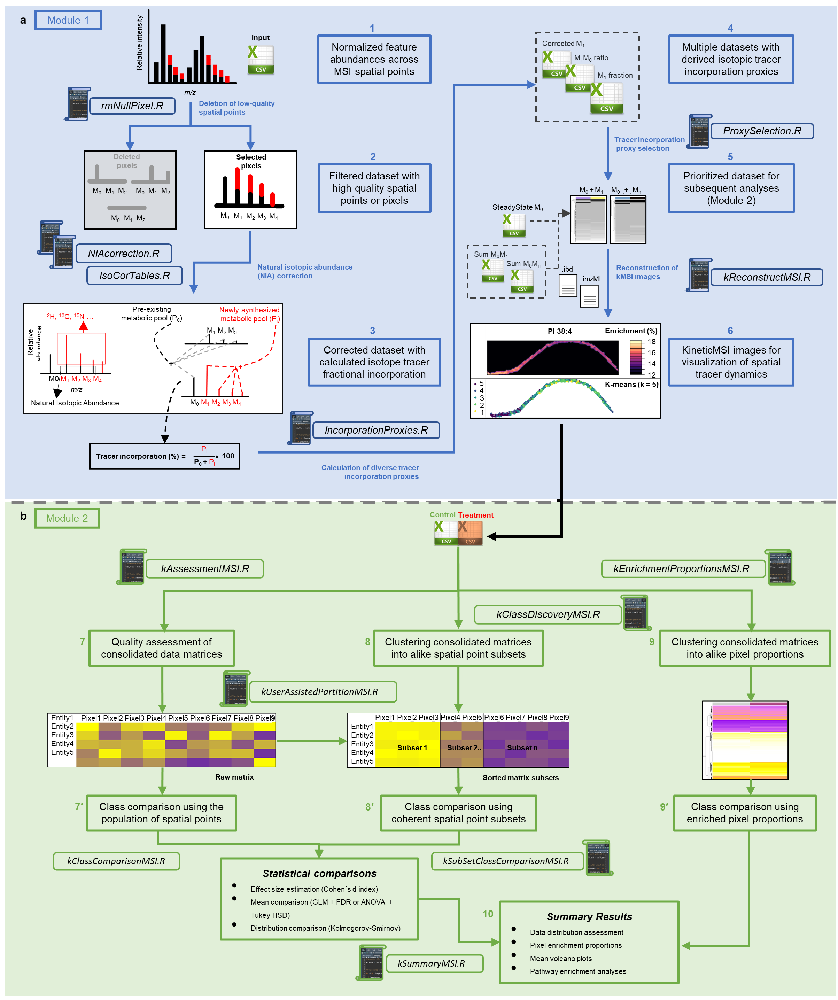

# KineticMSI
**Functions to interpret stable isotope assisted mass spec imaging experiments**
## Introduction
KineticMSI is a collection of scripts to assist in accurate data preparation and analysis of stable isotope assisted (kinetic) Mass Spectrometry Imaging experiments in order to derive functional biological interpretations. Additionally, the functionality available in KineticMSI is compatibile with stable isotope assisted liquid-chromatography mass spectrometry data. See below for a link to the KineticMSI to Kinetic LCMS (KineticMSI_2_kLCMS) repository and installation. The procedures described here are detailed in XXXXX and XXXXX publication.

The repo follows this file structure:

1. [Usage Instructions](https://github.com/MSeidelFed/KineticMSI/blob/master/USAGE.md): _detailed and recommended usage of R script code to run the analysis step-by-step._
1. [Data](https://github.com/MSeidelFed/KineticMSI/tree/master/inst/extdata): _sample data used in the original project from which the usage examples are based. Use this to reproduce our results._
1. [R_Functions](https://github.com/MSeidelFed/KineticMSI/tree/master/R): _collection of R scripts to carry out various steps of the analysis._

1. [Images](https://github.com/MSeidelFed/KineticMSI/tree/master/images): _some figures relevant to the repo_

Below is an illustration of the workflow.

**Workflow - Module I and II**



## Installation

### First step

It is necessary to install [Rtools](https://cran.r-project.org/bin/windows/Rtools/history.html) before starting. Make sure to install the appropriate version depending on your R version and add the Rtools directory to the system PATH (instructions for this can be found [here](https://datag.org/resources/documents/spring-2018/37-de-barros-installing-r-on-windows/file))

### Installing KineticMSI

```
library(devtools)

### Get the latest installation of RandoDiStats (KineticMSI depends on it)

devtools::install_github("MSeidelFed/RandodiStats_package")
library(RandoDiStats)

### Install KineticMSI

devtools::install_github("MSeidelFed/KineticMSI")
library(KineticMSI)


```

## Getting the exemplary datasets directory after installation

```
system.file("extdata", package = "KineticMSI")
```


## Link to KineticMSI to kLCMS repository and installation

https://github.com/MSeidelFed/KineticMSI_2_kLCMS

### Install KineticMSI_2_kLCMS


