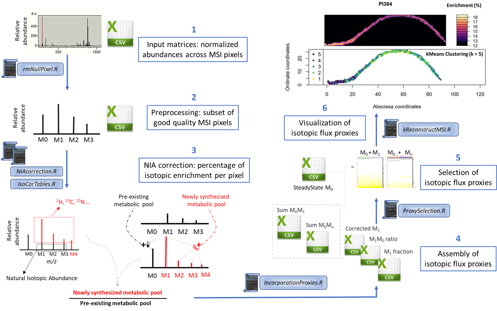
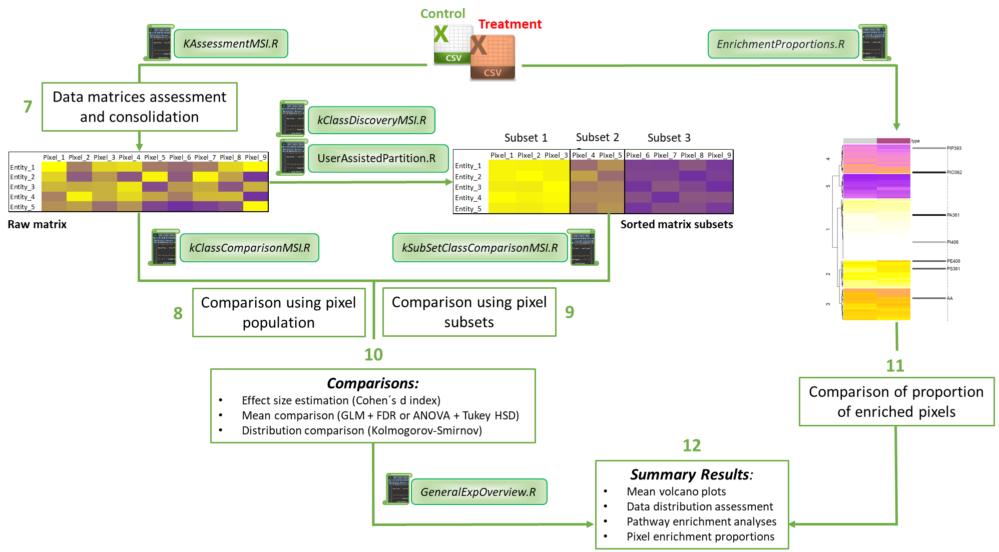

# KineticMSI
**Functions to interpret stable isotope assisted mass spec imaging experiments**
## Introduction
KineticMSI is a collection of scripts to assist in accurate data preparing and analyses of stable isotope assisted Mass Spectrometry Imaging experiments in order to derive functional biological interpretations. The procedure has been detailed in XXXXX and XXXXX publication.

The repo follows this file structure, in order of relevance:

1. [Usage Instructions](https://github.com/MSeidelFed/KineticMSI/blob/master/USAGE.md): _detailed and recommended usage of python and bash script code to run the analysis step-by-step._
1. [Data](https://github.com/MSeidelFed/KineticMSI/tree/master/inst/extdata): _sample data used in the original project from which the usage examples are based. Use  this to reproduce our results._
1. [R_Functions](https://github.com/MSeidelFed/KineticMSI/tree/master/R): _collection of R scripts to carry out various steps of the analysis._

1. [Images](https://github.com/MSeidelFed/KineticMSI/tree/master/images): _some figures relevant to the repo_

Below is an illustration of the workflow.

**Workflow PART I**



**Workflow PART II**




## Installation

```
library(devtools)

### Get the latest installation of RandoDiStats (KineticMSI depends on it)

devtools::install_github("MSeidelFed/RandodiStats_package")
library(RandoDiStats)

### Install KinetiMSI

devtools::install_github("MSeidelFed/KineticMSI")
library(KineticMSI)
```

## Getting the exemplary datasets directory after installation

```
system.file("extdata", package = "KineticMSI")
```


