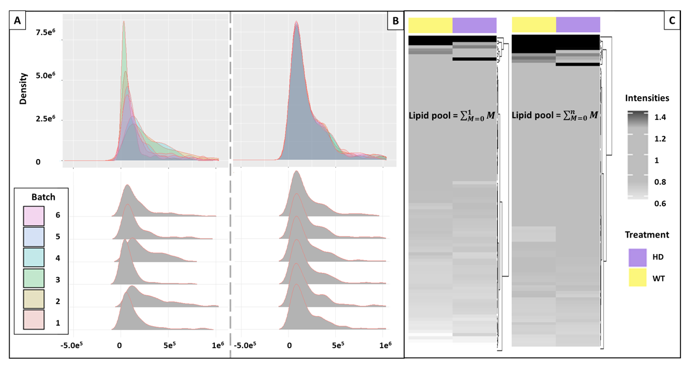

# kineticMSI
Functions to interpret stable isotope assisted mass spec imaging experiments

## Usage Instructions
kineticMSI has been divided in several steps:

1.   Data preprocessing: The procedure is meant to delete potentially confounding pixels which might be misinterpreted as enriched if left on the datasets during natural isotopic enrichment corrections.

1. Correcting for natural isotopic abundance (NIA): from the corrected isotopologue pools the enrichment percentages can be easily derived.

1. Determning the best proxy of enrichment: the used proxy can vary with diverse experimental strategies, i.e., tracer used, metabolic targets , detected isotopologues, enrichment percentages, isotopic envelope shifts.

1. Analyses of the tracer spatial dynamics and incorporation rates: This step is meant to reconstruct MSI images based on the derived proxies of isotope enrichment.

1. Comparing mean incorporation among mathematical quartiles instead of averaging: This crucial step classifies the coordinates from individual molecular species in subclasses based on the enrichment percentages in order to prevent dilution of the biology by averaging an entire region. Additionally, the procedure enables comparison to anatomical regions of interest obtained thorugh unsupervised statistical methods (From Cardinal SSC or SCiLS k-Means clustering).

1. Enrichment relative quantitation: The final step entails an integrated user-assisted relative quantitation and comparison analyses of the enrichment dynamics of the labelled metabolic targets. The procedure uses the classes discovered in the previous step.

## Step 0 - Input files

Peak picking is performed according to the user preference and the tables must be produced from the peak picking process. The input table must contain all metbolites or peptide mass features to be corrected along with their respective isotopologue envelopes. In the first column the metabolite identifiers are followed through a floor dash to the isotopologue number starting with 0 that represents the monoisotopic peak. Each column after the first contains the peak abundance across measured pixels in a MSI experiment. 

 Measurements/Samples| Pixel1     | Pixel2     | Pixel3        | Pixel4         | Pixel5      |
 ------------------- | -----------|------------| --------------| ---------------| ------------|
  [1,] "Met1_a0"     | "423677.9" | "387294.2" | "358360.2"    |  "430919.2"    | "314496.2"  |
  [2,] "Met1_a1"     | "112808.7" | "92034.8"  | "96068.4"     |  "118169.6"    | "102262.4"  |
  [3,] "Met1_a2"     | "40512.8"  | "38767.2"  | "31836.4"     |  "54474.4"     | "27531.1"   |
  [4,] "Met1_a3"     | "11019.2"  | "4510.01"  | "8081.9"      |  "13790.2"     | "10385.5"   |
  [5,] "Met2_a0"     | "117202.1" | "122309.3" | "90600.6"     |  "88196.6"     | "115123.8"  |
  [6,] "Met2_a1"     | "54163.9"  | "44717.6"  | "43496.6"     |  "149206.6"    | "59616.02"  |
  

## Step 1 - Preparing the dataset

*Procedure to crop pixels that could cause missinterpretation of the enrichment percentages from each lipid and pixel across datasets*

The function takes an entire directory or a single file, it grabs either all the csv files within the provided directory or a single csv file. In both cases the function grabs each lipid isotopologue and sets to NA all of those pixels that would produce a missinterpretation of the NIA correction leading to missinterpreted enrichment percentages. The directory must contain only the csv files that want to be corrected, additional csv in the directory will cause errors.

* Filtering step 1 – All pixels with M0 = 0 are deleted (replaced
with NA).

* Filtering step 2 – All pixels with all isotopologues = 0 are
deleted (replaced with NA).

```{r}

### keep output files in the R environment

NullPixel_rm_test <- NullPixel_rm(MeasurementFile_dir = "Data/", return_csv = T)

### only produce files outside the R environment without keeping data in the environment

NullPixel_rm(MeasurementFile_dir = "Data/", return_csv = T)

```

If return_csv is set to T The function returns the same number of csv files located in the input directory, corrected and signaled with the addition in the identifier of "_rm0"


## Step 2 - Natural Isotopic Abundace Correction

Enrichment percentages are calculated using the algorithms described in 

  *Heinrich, P., Kohler, C., Ellmann, L., Kuerner, P., Spang, R., Oefner, P. J., and Dettmer, K. (2018). Correcting for natural isotope abundance and tracer impurity in MS-, MS/MS- and high-resolution-multiple-tracer-data from stable isotope labeling experiments with IsoCorrectoR. Sci. Rep. 8.*
  
  *Millard, P., Delépine, B., Guionnet, M., Heuillet, M., Bellvert, F., Létisse, F., and Wren, J. (2019). IsoCor: Isotope correction for high-resolution MS labeling experiments. Bioinformatics 35:4484–4487.*

The procedures correct the endogenous metabolite or peptide pools for natural isotopic abundance (NIA) according to the chemical formula before calculating enrichment percentages via a simple A0 to An division. The IsoCorrectoR can be used in R and the IsoCor in python to obtain equivalent percentages of enrichment and NIA correction of molecular species with cross validation from both platforms.

### IsoCorrectoR workflow
IsoCorrectoR has been installed and used according to the instructions provided upon releasing of the package in BioConductor (https://www.bioconductor.org/packages/release/bioc/html/IsoCorrectoR.html) as follows:

For MSI, each column in the input table "MeasurementFile.csv" belongs to a single coordinate on the original image where the isotopologues could be measured and mined out.

```{r}

library(IsoCorrectoR)

Enrichment <- IsoCorrectoR::IsoCorrection(MeasurementFile = "Data/WT_rep1_rm0.csv",
                                     ElementFile = "Data/IsoCorectoR_Files/ElementFile.csv",
                                     MoleculeFile = "Data/IsoCorectoR_Files/MoleculeFile.csv",
                                     CorrectTracerImpurity = T,
                                     CorrectTracerElementCore = T,
                                     CalculateMeanEnrichment = T,
                                     UltraHighRes = F,
                                     FileOut = "test",
                                     FileOutFormat = "csv",
                                     ReturnResultsObject = T,
                                     CorrectAlsoMonoisotopic = T)

```

Alternatively, we are providing a function to pipe all the "rm0" files through IsoCorrectoR for bash correction, for our function to work, all csv input files must be in a subdirectory one level below the main workspace.

``` {r}

library(IsoCorrectoR)

NIA_correctionMSI(rm0_dir = "Data/",
                  pattern = "_rm0",
                  ElementFile_dir = "Data/IsoCorectoR_Files/ElementFile.csv",
                  MoleculeFile_dir = "Data/IsoCorectoR_Files/MoleculeFile.csv", 
                  out_dir = "Data/IsoCorectoR_Files/")

```

The output are folders containing csv files with NIA corrected isotopologue abundances, enrichment percentage calculations and other relevant values in the *k*MSI context.

### IsoCor workflow
Finally, as a cross validation step of the enricment percentage calculations we provide a function to transform the IsoCorrectoR tables into the format of IsoCor for python.

Python version when working with a modular system was: 
```
module add devel/Python-3.8.0
```

IsoCor input tables have the following format:

 sample              | metabolite | derivative | isotopologue  | area           | resolution  |
 ------------------- | -----------|------------| --------------| ---------------| ------------|
  [1,] "Sample_X"    | "PIP2492"  | ""         | "0"           |  "52335.21982" | "70000"     |
  [2,] "Sample_X"    | "PIP2492"  | ""         | "1"           |  "75684.458"   | "70000"     |
  [3,] "Sample_X"    | "PIP2492"  | ""         | "2"           |  "0"           | "70000"     |
  [4,] "Sample_X"    | "PIP2492"  | ""         | "3"           |  "0"           | "70000"     |
  [5,] "Sample_X"    | "PIP2492"  | ""         | "4"           |  "0"           | "70000"     |
  [6,] "Sample_X"    | "PIP2492"  | ""         | "5"           |  "0"           | "70000"     |

and can be obtained from our universal input csv format file (Data/Universal_Isotopologue_File.csv) using the function ProduceIsoCorTables as follows:

```
WT1 <- ProduceIsoCorTables(PathToCSV_file = "Replicate 1/Pyr layer replicate1  29WT.csv")
```
Subsequently, the output table can be directly used by IsoCor following the published instructions (https://github.com/MetaSys-LISBP/IsoCor).

## Step 3 - Determining which incorporation proxy matches the biology

here we derive several isotope incorporation proxies from the IsoCorrectoR produced tables and determine which one resembles better the biology on the system and thus is a legitimate proxy to enrichment percentage.

* First a function is provided in order to produce:

    * A file with the corrected M0s

    * A file with the corrected M1s

    * A file with the M1 M0 ratios

    * A file with the M1 fraction relative to a steady state pool calculated only based on the sum of M1 + M0
    
    * Finally and more importantly two files containing the steady state pools as calculated from the M0 + M1 sum or the M0+....+Mn sum to determine which one resembles the biology best. In order to do this step one requires additionally a matrix with the non-labelled steady states which will be used as comparison in the next step.

```{r}
IncorporationProxys(Parent_dir = "Data/IsoCorectoR_Files/", SteadyStatePools_dir = "Data/Steady_state_pools/")
```
The steady state files contain the mean across pixels from each molecular species across datasets. Thus, since these are not related to a single preexisting IsoCorrectoR folder but to all folder, these are allocated into a new directory that defaults to the current workspace if not specified.

* Second the actual comparison between non-labelled and labelled steady state pools is built: (*as an example we have provided a [file](https://github.com/MSeidelFed/KineticMSI/blob/master/Data/Steady_state_pools/SteadyStatePoolsM1M0_NL.csv) containing the steady state pools from non-labelled controls compared to the labelled exemplary datasets*)

    * The first step is to remove any batch effect from the steady state pools. To achieve that we provide the BatchCorrection function, which depends on ComBat correction as detailed in the [SVA package](https://rdrr.io/bioc/sva/man/ComBat.html). The procedure was defined for microarray data to correct for between chip variation. Similarly MSI data from different days may suffer from batch effects that systemically affect abundances either positively or negatively. The function is interactive and must be run from the command line in order to take advantage of its interactive features, i.e., The function progressively shows the user how the data is distributed among batches in order to decide if batch correction is actually needed. There is an option to duplicate data in case not enough Batch members exist and that precludes the correction, defauts to FALSE.
    
    * The second step is to compare both the non-labelled and the labelled steady state pools in order to determine which isotopologue envelope mimics best the biology of the actual pool changes.

```{r}
library(reshape2)
library(ggplot2)
library(ggridges)
library(sva)

## 1 Batch correction

NC_norm_Ln_Transformed_M1M0 <- BatchCorrection(array_dir = "Data/Steady_state_pools/SteadyStatePoolsM1M0.csv",
                                               Treatments_dir = "Data/Steady_state_pools/Treatments_L.csv", 
                                               Duplicate = F)

NC_norm_Ln_Transformed_M1Mn <- BatchCorrection(array_dir = "Data/Steady_state_pools/SteadyStatePoolsM1Mn.csv",
                                               Treatments_dir = "Data/Steady_state_pools/Treatments_L.csv", 
                                               Duplicate = F)
                                          
## 2 Comparing the biology

```

e.g., batch correction necessities in M1 + M0 steady state pools:



After Batch correction, only non-empty rows remain, and that means that if the matrices contain many missing values, not all molecular species will be in the resulting file. In our example only 50 lipids remain after batch correction. These 50 lipids are then used to compare the biology. The non-labelled steady state exemplary [file](https://github.com/MSeidelFed/KineticMSI/blob/master/Data/Steady_state_pools/SteadyStatePoolsM1M0_NL.csv) is already batch corrected.

## Step 4 - Spatial dynamics of the tracer

Following the enrichment calculation procedure, and aiming at taking advantage of the gained spatial dimensions provided by MSI, we explored the kinetics of the tracer in the tissue. To do that we built a fuction that uses percentages of enrichment from specific mass features to reconstruct the tissue slide gaining insigths on which tissue areas, if at all, have incorporated more tracer. The function has a dependency to the Cardinal R package (https://www.bioconductor.org/packages/release/bioc/html/Cardinal.html).

``` 
if(!require(Cardinal)) {BiocManager::install("Cardinal"); require(Cardinal)}
library(Cardinal)

example_kMSI <- Kinetic_MSI(file = "Imaging_File_Directory", MSI_type = "MSImageSet", Enrichment_File = Enrichment_File_Directory)
``` 

The outcome from this visual evaluation is a prioritization of peptides or metabolites for the subsequent steps.

## Step 3 - Clustering active regions with differential tracer incorporation 

### drawing the SCC image and selecting an specific cluster as output

There is one mandatory parameter in the function, file_name_WO_extension, which refers to the directory and name of your .ibd and .imzML files. Furthermore there are four optional parameters; type, refers to the kind of Cardinal object that the workflow will use (options are "MSImageSet" and "MSImagingExperiment"). Then you can tune the mathematical parameters of your partitions r, k and s. And the last parameter refers to the cluster_Nr that you want to obtain a data matrix of. Specially usefull to isolate a matrix of your experimental segment

``` 
example_SSC <- segmentation_initial_steps(file_name_WO_extension = "Imaging_File_Directory", type = "MSImageSet", r = 1, k = 5, s = 3, cluster_Nr = 2)
``` 

The output is a segmented image of your file and a data matrix containing the information of your selected cluster.

``` 
example_SSC[1:5,1:3]

                             x = 49, y = 2, z = 1         x = 50, y = 2, z = 1          x = 40, y = 3, z = 1
286.984753095237             7.712556                     8.307419                      7.192391
289.058499875001             5.743113                     5.350798                      5.144504
290.100985837298             0.000000                     0.000000                      3.810359
315.017782775377             0.000000                     0.000000                      0.000000
325.13129680233              0.000000                     0.000000                      0.000000
``` 

## Step 4 - Relative quantitation


