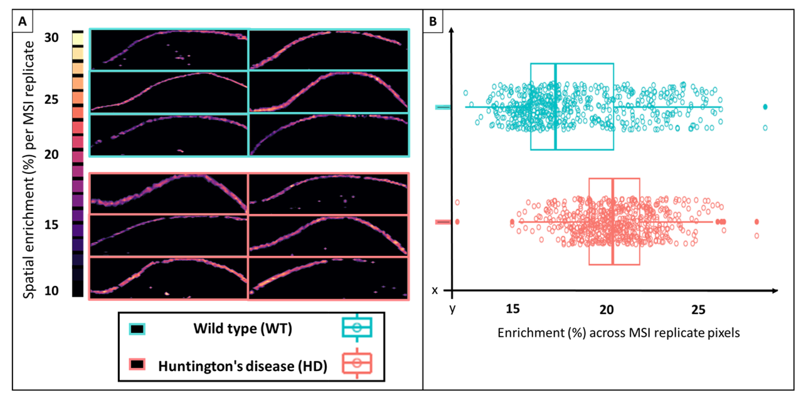

# kineticMSI
***Functions to interpret stable isotope assisted mass spectrometry imaging experiments***

## Usage Instructions
KineticMSI has been divided in several steps:

1.  Input data: Necessary to start are data matrices featuring normalized or ready-to-compare abundances across MSI pixels.

1.  Data preprocessing: The procedure is meant to delete potentially confounding pixels, which might be misinterpreted as enriched if left on the datasets during natural isotopic enrichment corrections.

1. Correcting for natural isotopic abundance (NIA): from the corrected isotopologue pools, the enrichment percentages can be easily derived.

1. Assembling of isotopic flux proxies for analyzing the tracer dynamics.

1. Visualization and determination of the best isotopic flux proxies. The used proxy can vary with diverse experimental strategies, i.e., tracer used, metabolic targets, detected isotopologues, enrichment percentages, isotopic envelope shifts.

1. Visualization of isotopic flux proxies and analyses of the tracer spatial dynamics. This step is meant to reconstruct kMSI images based on the derived proxies of isotope enrichment.

1. Quality assessment of consolidated data matrices.

1. Class comparison using pixel populations.

1. Subsetting of consolidated data matrices into alike pixel sets. This step classifies the coordinates from individual molecular species in subclasses based on the enrichment proxies selected in order to prevent dilution of the biology by averaging an entire region. The procedure enables comparison to anatomical regions of interest obtained through unsupervised statistical methods (e.g., from [Cardinal](https://cardinalmsi.org/) SSC or [SCiLS](https://scils.de/) K-means clustering).

1. Class comparison using pixel subsets. The final step entails an integrated user-assisted relative quantitation and comparison analyses of the enrichment dynamics of the labelled metabolic targets. The procedure uses the classes discovered in the previous step.

1. Class comparison using enriched pixel proportions.

1. KineticMSI summary results.

## Step 0 - Installation

```{r}

library(devtools)
devtools::install_github("MSeidelFed/KineticMSI")
library(KineticMSI)

## Getting the exemplary datasets directory after installation

Path2ExemplaryFiles <- system.file("extdata", package = "KineticMSI")

```

## Step 1 - Input matrices: normalized abundances across MSI pixels

Peak picking is performed according to the user preference and the tables must be produced from the peak picking process. The input table must contain all metabolites or peptide mass features to be corrected along with their respective isotopologue envelopes. In the first column, the metabolite identifiers are followed through a floor dash to the isotopologue number starting with 0 that represents the monoisotopic peak. Each column after the first contains the peak abundance across measured pixels in a MSI experiment.


                        Measurements/Samples| Pixel1     | Pixel2     | Pixel3        | Pixel4         | Pixel5      |           
                        ------------------- | -----------|------------| --------------| ---------------| ------------|
                         [1,] "Met1_a0"     | "423677.9" | "387294.2" | "358360.2"    |  "430919.2"    | "314496.2"  |
                         [2,] "Met1_a1"     | "112808.7" | "92034.8"  | "96068.4"     |  "118169.6"    | "102262.4"  |
                         [3,] "Met1_a2"     | "40512.8"  | "38767.2"  | "31836.4"     |  "54474.4"     | "27531.1"   |
                         [4,] "Met1_a3"     | "11019.2"  | "4510.01"  | "8081.9"      |  "13790.2"     | "10385.5"   |
                         [5,] "Met2_a0"     | "117202.1" | "122309.3" | "90600.6"     |  "88196.6"     | "115123.8"  |
                         [6,] "Met2_a1"     | "54163.9"  | "44717.6"  | "43496.6"     |  "149206.6"    | "59616.02"  |


## Step 2 - Preprocessing: subset of good quality MSI pixels

*A function to crop input KineticMSI datasets*

This function allows you to remove MSI pixels that would impair interpretation of true 0% enrichment in the downstream calculations. The function generates corrected .csv files and a list with the corrected matrices as a return object in the R environment.The function takes an entire directory and it grabs all .csv files within the provided directory. The function then grabs each isotopologue envelope and sets to NA all of those pixels that would produce a misinterpretation of the NIA correction leading to misinterpreted enrichment percentages. 

* Filtering step 1 – All pixels with M<sub>0</sub> = 0 are deleted (replaced with NA). 

* Filtering step 2 – All pixels with all isotopologues = 0 are deleted (replaced with NA).

```{r}

rmNullPixel_test <- KineticMSI::rmNullPixel(MeasurementFileDir = Path2ExemplaryFiles,
                                            pattern = "rep.\\.csv",
                                            SubSetReps = FALSE,
                                            csvReturn = TRUE,
                                            OnlyDeletePixelsWOIsotopologs = FALSE,
                                            verbose = FALSE,
                                            verboseFeature = FALSE,
                                            rmDataStore = "NewDir",
                                            outdir = "rmOutput")

```

## Step 3 - Natural Isotopic Abundance (NIA) correction: percentage of isotopic enrichment per pixel


Enrichment percentages are calculated using the algorithms described in 

  *Heinrich, P., Kohler, C., Ellmann, L., Kuerner, P., Spang, R., Oefner, P. J., and Dettmer, K. (2018). Correcting for natural isotope abundance and tracer impurity in MS-, MS/MS- and high-resolution-multiple-tracer-data from stable isotope labeling experiments with IsoCorrectoR. Sci. Rep. 8.*
  
  *Millard, P., Delépine, B., Guionnet, M., Heuillet, M., Bellvert, F., Létisse, F., and Wren, J. (2019). IsoCor: Isotope correction for high-resolution MS labeling experiments. Bioinformatics 35:4484–4487.*


The procedures correct the endogenous metabolite or peptide pools for natural isotopic abundance (NIA) according to the chemical formula before calculating enrichment percentages via a simple A<sub>0</sub> or M<sub>0</sub> to A<sub>n</sub> or M<sub>n</sub> division. The IsoCorrectoR can be used in R and the IsoCor in python to obtain equivalent NIA correction and subsequent percentages of enrichment from molecular species.

### IsoCorrectoR workflow

*A function to correct natural isotopic abundances (NIA) from KineticMSI datasets or multiple csv files with the right format*

[IsoCorrectoR](https://www.bioconductor.org/packages/release/bioc/html/IsoCorrectoR.html) has been installed and used according to the instructions provided upon releasing of the package in BioConductor.

This function allows you to correct isotopologue envelopes for NIA inheriting all specifications from the R package IsoCorrectoR. The function calculates the percentage of enrichment of a defined stable isotope as well as other important values that reflect tracer dynamics within enrichment experiments. The function takes an entire directory and grabs all the .csv files contained within in a recursive manner. Subsequently, the function generates .csv files with each of the relevant returns in the *kinetic*MSI context. Each column in the input table "MeasurementFile.csv" belongs to a single coordinate on the original image where the isotopologues could be measured and mined out.

```{r}

suppressWarnings(KineticMSI::NIAcorrection(MeasurementFileDir = "rmOutput/",
                                           pattern = "_rm0", 
                                           SubSetReps = FALSE,
                                           ElementFileDir = paste0(Path2ExemplaryFiles, "/ElementFile.csv"),
                                           MoleculeFileDir = paste0(Path2ExemplaryFiles, "/MoleculeFile.csv"),
                                           kCorrectTracerImpurity = TRUE,
                                           kCorrectTracerElementCore = TRUE,
                                           kCalculateMeanEnrichment = TRUE,
                                           kCorrectAlsoMonoisotopic = TRUE,
                                           kUltraHighRes = FALSE,
                                           kCalculationThreshold = 10^-8,
                                           kCalculationThreshold_UHR = 8,
                                           verbose = FALSE,
                                           outdir = "OutputIsoCorrectoR"))

```

IsoCorrectoR generates warnings when there are not as many isotopologue measured abundances as potentially labelled atoms in the molecule, indicating that NIA correction may be skewed. We recommend that users run this function within the suppressWarnings() R function because in the presence of warnings and given the numerous pixels per MSI experiment, a single KineticMSI dataset could take a very long time to run. The time is mostly spent on writing the warnings to the console. Thus when warnings are suppressed, the efficiency of the function increases dramatically.

Additionally, as a cross validation step of the enrichment percentage calculations, we provide a function to transform the IsoCorrectoR tables into the format of IsoCor to be run in Python.

### IsoCor workflow

*A function to produce the input files for Python-based correction of natural isotopic abundances (NIA)*

This function allows you to produce the input files needed for the Python tool [IsoCor](https://pypi.org/project/IsoCor/) that corrects isotopologue envelopes for NIA. The function takes a single csv file with the right format and transforms it. Subsequently, the function generates a matrix to the R environment that can be exported in any desired format to serve as input for IsoCor.


Python version when working with a modular system was:

                                                      module add devel/Python-3.8.0


IsoCor input tables have the following format:

                        sample              | metabolite | derivative | isotopologue  | area           | resolution  |
                        ------------------- | -----------|------------| --------------| ---------------| ------------|
                         [1,] "Sample_X"    | "PIP2492"  | ""         | "0"           |  "52335.21982" | "70000"     |
                         [2,] "Sample_X"    | "PIP2492"  | ""         | "1"           |  "75684.458"   | "70000"     |
                         [3,] "Sample_X"    | "PIP2492"  | ""         | "2"           |  "0"           | "70000"     |
                         [4,] "Sample_X"    | "PIP2492"  | ""         | "3"           |  "0"           | "70000"     |
                         [5,] "Sample_X"    | "PIP2492"  | ""         | "4"           |  "0"           | "70000"     |
                         [6,] "Sample_X"    | "PIP2492"  | ""         | "5"           |  "0"           | "70000"     |


The exemplary format can be obtained from the provided universal input csv format file ("IsoCorInputTable.csv").

```{r}

IsoCor_test <- KineticMSI::IsoCorTables(PathToCSV = paste0(Path2ExemplaryFiles, "/IsoCorInputTable.csv"))

```
Subsequently, the output table can be directly used by [IsoCor](https://github.com/MetaSys-LISBP/IsoCor) following the published instructions.

The following steps aim to derive various isotope incorporation proxies from the tables produced by IsoCorrectoR and determine which proxy describes best the biology of the system. In this sense, these functions are a tool to legitimate the tracer dynamics within the studied system. The procedure detailed is subdivided in two independent steps, which do not need to be completed to be useful, users may rather use one or the other depending on the data availability.

## Step 4 - Assembly of isotopic flux proxies

*A function to produce files that describe through different proxies the tracer dynamics within kineticMSI datasets*

This function allows to calculate across MSI pixels various values that reflect different aspects of the tracer dynamics. The function tests if the molecular features are shared across all datasets, if these are not shared, the function produces files with the common features before carrying on with the calculations. This is to prevent errors in the joined steady state pool files that are generated. The function outputs the isotope incorporation proxies as .csv files to the same input directories.

```{r}

KineticMSI::IncorporationProxies(ParentDir = "OutputIsoCorrectoR/", 
                                 SteadyStatePoolsDir = "SteadyStatePools/",
                                 ColSumNorm = FALSE)
                                 
```

* The function produces:

    * A file with the corrected M<sub>0s</sub> or A<sub>0s</sub>

    * A file with the corrected M<sub>1s</sub> or A<sub>1s</sub>

    * A file with the M<sub>1</sub> or A<sub>0</sub> / M<sub>0</sub> or A<sub>1</sub> ratios 

    * A file with the M<sub>1</sub> or A<sub>1</sub> fraction relative to a steady state pool calculated only based on the sum of M<sub>1</sub> or or A<sub>1</sub> + M<sub>0</sub> or or A<sub>0</sub>
    
    * A file with the *de novo* synthesized pool either normalized or not
    
    * Two files containing the steady state pools as calculated from the M<sub>0</sub> or A<sub>0</sub> + M<sub>1</sub> A<sub>1</sub> sum or the M<sub>0</sub> or A<sub>0</sub> +....+ M<sub>n</sub> or A<sub>n</sub> sum. These files are used to determine which one resembles the biology best in the step 3b. This requires an additionally matrix with non-labelled steady states, which will be used as comparison. The steady state files contain means across pixels from each molecular species in all datasets. Thus, since these are not related to a single preexisting IsoCorrectoR folder but to all folders at once, the output are allocated into a new directory that defaults to the current workspace if not specified.

## Step 5 - Selection of isotopic flux proxies: legitimate reflection of the biological system

*A function to select an isotope proxy that best reflects the changes seen in steady state pools measured without stable isotope assisted mass spectrometry*

This function allows to compare the steady state pools from molecular features that were measured through both stable assisted and conventional mass spectrometry. By contrasting the results from different isotope combinations (e.g., A<sub>0</sub> or M<sub>0</sub> to A<sub>n</sub> or M<sub>n</sub> versus A<sub>0</sub> or M<sub>0</sub>  to A<sub>1</sub> or M<sub>1</sub>) users can easily define how many isotopes reflect the actual pool changes of the target molecular features in their biological systems. The input files must have the same treatment rows while molecular feature may vary. The algorithm will select the features in common for the calculations.

Examples:
 
   * As an example we have provided a [file](https://github.com/MSeidelFed/KineticMSI/blob/master/Data/Steady_state_pools/SteadyStatePoolsM1M0_NL.csv) containing the steady state pools from non-labelled controls compared to the labelled exemplary datasets*). The exemplary file was built based on the unlabelled features, taking the monoisotopic peak as a proxy of the feature pool. Consequently the derived labelled steady states were built by summing the non-corrected M<sub>0</sub> or A<sub>0</sub> abundances plus its corrected isotopologues (M<sub>1</sub> or A<sub>1</sub>....M<sub>n</sub> or A<sub>n</sub> or only M<sub>1</sub> or A<sub>1</sub>). Corrected M<sub>0</sub> or A<sub>0</sub> contains the NIA and thus summing it with the isotopologues would not be equivalent to the non-labelled picked M<sub>0</sub> or or A<sub>0</sub> peaks.

   * The first step is to remove any batch effect from the steady state pools. To achieve that we provide the BatchCorrection function, which depends on ComBat correction as detailed in the [SVA package](https://rdrr.io/bioc/sva/man/ComBat.html). The procedure was defined for microarray data to correct for between chip variation. Similarly, MSI data from different days may suffer from batch effects that systemically affect abundances either positively or negatively. The function is interactive and must be run from the console in order to take advantage of its interactive features, i.e., the function progressively shows the user how the data is distributed among batches in order to decide if batch correction is actually needed. There is an option to duplicate data in case not enough Batch members exist and that precludes the correction.
    
   * The second step is to compare both the non-labelled and the labelled steady state pools in order to determine which isotopologue envelope mimics best the biology of the actual pool changes. To achieve that we provide the *LvsNLpools* function, which needs as input the batch corrected datasets, a factor indicating the treatments to be compared, and a logical value indicating whether the treatments are averaged. The function then calculates the ratios between equivalent labelled and non-labelled steady states and plots the ratios as a heatmap. An ideal scenario would be steady state pools with a ratio of 1, which would indicate that the biology between the labelled and non-labelled dataset is fully preserved across treatments. Thus, this function provides an efficient filter to decide which molecular species to further consider for evaluation.


```{r}

proxy_M0M1 <- suppressWarnings(KineticMSI::ProxySelection(LabelledFileDir = "SteadyStatePools/SteadyStatePoolsM0M1.csv",
                                                          TreatmentFileDir = paste0(Path2ExemplaryFiles,
                                                                                    "/Treatments_L.csv"), 
                                                          NLSteadyStatePoolsDir = paste0(Path2ExemplaryFiles,
                                                                                         "/SteadyStatePoolsM1M0_NL.csv"),
                                                          BatchCorr = T,
                                                          TreatmentIntoMeans = T,
                                                          Factor = as.factor(c(rep("HD",6), rep("WT",6))),
                                                          Duplicate = F))

```

```{r}

proxy_M0Mn <- suppressWarnings(KineticMSI::ProxySelection(LabelledFileDir = "SteadyStatePools/SteadyStatePoolsM0Mn.csv",
                                                          TreatmentFileDir = paste0(Path2ExemplaryFiles,
                                                                                    "/Treatments_L.csv"), 
                                                          NLSteadyStatePoolsDir = paste0(Path2ExemplaryFiles,
                                                                                         "/SteadyStatePoolsM1M0_NL.csv"),
                                                          BatchCorr = T,
                                                          TreatmentIntoMeans = T,
                                                          Factor = as.factor(c(rep("HD",6), rep("WT",6))),
                                                          Duplicate = F))

```

e.g., The following exemplifies batch correction necessities in M<sub>1</sub> + M<sub>0</sub> steady state pools plus the Heatmap of the labelled / non-labelled steady state pools. The results indicate that for some lipids the biology is fully preserved (i.e., ratios around 1, whereas for others, abundances might be underestimated in one dataset as compared to the other, i.e., yellow abundances):


Note that the Heatmap built on the sum from M<sub>0</sub> to M<sub>n</sub> contains fewer extreme values and thus can be regarded as a better proxy to the actual biology in our dataset. This can be observed in the returned ordered matrices from the function, which are equivalent to the actual heatmap.

After Batch correction, only non-empty rows remain, and that means that if the matrices contain many missing values, not all molecular species will be in the resulting file. In our example, the 85 lipids remain after batch correction. These 85 lipids are then used to compare the biology. The non-labelled steady state exemplary file is already batch corrected.

As an example, we continue our analyses using all lipids but interpreted with caution isotope tracer results that are derived from species with a labelled / non-labelled ratio that lies outside a 0.6 - 1.4 range. Using a range, we allow for biological variation while getting rid of lipids with low abundances that are further diluted by deuterium causing a drop in the ratio. The upper range of the ratio does not contain outliers, but outliers in this area might indicate lipids with more isotopologues found during peak picking, which would contain "extra" biased abundances in the labelled treatments due to partial accurateness in NIA correction.

## Step 6 - Visualization of isotopic flux proxies: spatial dynamics of the tracer

*A function to produce graphical reconstructions from MSI images using isotope tracer dynamics*

This function allows to produce the first type of inference on the replicated datasets that KineticMSI offers. The function produces first boxplots that reflect the dispersion of the chosen isotope tracer proxy across MSI pixels and treatments. The boxplots are produced both for separate replicates and as treatment means. Afterwards the function reconstructs the MSI acquired images by extracting the coordinates from the .ibd .imzML input files and using them to build reconstructed images that reflect the isotope tracer dynamics within the samples specimen. The function has two different run possibilities, it may be run "before" or "after" the KineticMSI class discovery function. In the former case the function will build clusters during the spatial reconstruction of images using a K-mean clustering algorithm and attempting at clustering together pixels based on specific similarity or dissimilarity metrics. In the latter case the clusters are inherited from the kClassDiscoveryMSI function output when the parameter returnObject is set to "minDatasetPlusCoords".

The function has a dependency to the [Cardinal](https://www.bioconductor.org/packages/release/bioc/html/Cardinal.html) R package . 

```{r}

library(viridis)

example_reconstruct <- kReconstructMSI(Reconstruct = "Before",
                                       path = ".", 
                                       PatternEnrichment = "MeanEnrichment.csv",
                                       outpath = getwd(), 
                                       as = "MSImagingExperiment",
                                       PositionIntensitiesLegend = "topright",
                                       PositionClusterLegend = "bottomleft",
                                       clustMethod = "average", 
                                       clustDistance = "euclidean", 
                                       kmeans = 5, 
                                       KmBoot = 10,
                                       RevOrdinates = F,
                                       RevAbscissas = F,
                                       FactorName = "Genotype",
                                       yLabName = "Enrichment (%)",
                                       paletteSpatialPlots = magma,
                                       ContrastPercentValue = 0.1,
                                       SubSetRepsIntensities = F,
                                       SubSetRepsMSI = F)

``` 

The outcome from this visual evaluation is a PDF containing the spatial dynamics of the tracer in the tissue interrogated. In some cases it might be apparent that there are areas of high enrichment or potential synthesis, e.g.:



Note that K-mean partitions signal areas of tracer incorporation when those are spatially constrained. The boxplots representing pixel enrichment dispersions are detailed in the next section. 

## Step 7 - Quality assesment of consolidated data matrices

*A function to perform an initial step of replicated data quality assessment on KineticMSI datsets*

This function allows KineticMSI users to assess the quality in terms of reproducibility and mean distribution from measured molecular features across several independent treatments. The function first subsets all datasets to a common vector of molecular features and a common number of pixels. If molecular features are not the same across datatsets, the function produces new sets with the "Shared Features", which are named with this extension in the original IsoCorrectoR folders. Pixels are previously sorted per sample according to their magnitude, e.g., in the case of enrichment percentage from high to low enrichment. Afterwards a plot reflecting the ratio of means from subset and entire sets is produced in order to evaluate whether the subsetting procedure is skewing the data or whether the change trends will be fully preserved. An alternative to sorting by magnitude is sorting by acquisition time, which allows the users later on to evaluate differences that might be constrained in space or dependent on the instrument performance during a single sample. The function returns distribution plots in a PDF file across treatments that allow interpreting shifts in data that would otherwise remain unnoticed. Finally the function also returns either a list with the minimum datasets for all matrices or the compressed matrices used for mean distribution assessment and later for mean class comparison across samples.

```{r}

ex_assesment <- kAssesmentMSI(path = "OutputIsoCorrectoR/", 
                              PatternEnrichment = "MeanEnrichment_SharedFeatures", 
                              SubSetRepsIntensities = FALSE, 
                              CompareSampledSet = TRUE,
                              returnObject = "RowMeansDataset",
                              factorVector = c(rep("HD", 6),
                                               rep("WT", 6)),
                              fun2clust = "Enrichment",
                              logiTransformation = FALSE,
                              ZeroAction = "replace",
                              ScalingFactorXaxisDensityPlot = NULL)

```
### St.Dev and means comparison

After sorting, a plot reflecting the ratio of means from subset and entire sets is produced in order to evaluate whether the subsetting procedure is skewing the data or whether the change trends will be fully preserved.


### Data distribution assessment

The function returns distribution plots in a PDF file across treatments that allow interpreting shifts in data that would otherwise remain unnoticed.


### Regression family suggestion for parametrized mean comparison

The function also averages all pixels into a single mean per treatment and evaluates the resulting numeric vector distribution to suggest a link function for the glm regression according to the procedure detailed in the [RandoDiStats](https://github.com/MSeidelFed/RandodiStats_package) R package.


If the suggested link is Gaussian, as in the example, any parametric test will suffice to compare means and the *P*-values will be legitimate. If on the contrary, the suggested link is non-parametric we strongly suggest using a parameterized glm as means of class comparison. 

Finally the function also returns either a list with the minimum datasets for all matrices or the compressed matrices used for mean distribution assessment and later for mean class comparison across samples.

## Step 8 - Class comparison using pixel populations

*A function that allows class comparison in replicated KineticMSI datasets*

This function allows KineticMSI users to use classical class comparison algorithms such as ANOVA + Tukey HSD or generalized linear models (GLMs) + FDR correction. The input for the function comes from the previous kAssessmentMSI.R output. The function outputs graphics embedded in PDF files detailing the results from the class comparison algorithms. Additionally, a table with all the results is returned to the environment when the ouput is assigned to an object.

```{r}

test_kclcomp <- kClassComparisonMSI(kAssesmentOutput = ex_assesment,
                                    factorVector = c(rep("HD", 6),
                                                     rep("WT", 6)),
                                    PDFname = "Population_ClassComparison", 
                                    returnGLMplots = TRUE,
                                    patternGLMplot = "Q values",
                                    ylabTukey = "test y",
                                    xlabTukey = NULL,
                                    ylabGLM = "test x",
                                    xlabGLM = NULL)

```

## Step 9 - Subsetting of consolidated data matrices into alike pixel sets 

*A function to subset consolidated KineticMSI datasets into groups of related pixels*

This function allows users to subset consolidated KineticMSI matrices (see our kAssesmentMSI.R function for details) into subsets that are validated internally by the data structure. The function clusters consolidated data matrices using a hierarchical clustering algorithm (HCA) with bootstrapping, which is a dependency from the R package pvclust. Then using a user defined significance threshold the function grabs an optimized number of significant clusters that feature AU-P values above the threshold. The optimization increases the threshold when many significant clusters are found until it optimizes the outcome to the minimum cluster number, or if there are any significant clusters then the optimization parameter lowers the threshold until obtaining significant partitions. The outcome from this tuning process is returned to the console. The function returns to the R environment a list of abundances and coordinates matrices per molecular feature that can be used to both map the clusters onto the original MSI images using kReconstructMSI.R or perform class comparison using the clustered subsets using kSubSetClassComparisonMSI.R. Additionally the function returns to the working directory a number of diagnostic plots that allow users to better contextualize the partitions in their datasets.

```{r}

ClassDiscovery_HD_test <- kClassDiscoveryMSI(path = "OutputIsoCorrectoR/",
                                             PatternEnrichment = "MeanEnrichment_SharedFeatures",
                                             DistMethod = "abscor",
                                             nboot = 100,
                                             alpha = 0.95,
                                             SigClustHist = TRUE, 
                                             SubSetRepsIntensities = TRUE,
                                             CompareSampledSet = TRUE,
                                             fun2clust = "Enrichment",
                                             ZeroAction = "replace",
                                             returnObject = "minDatasetPlusCoords",
                                             logiTransformation = FALSE)

ClassDiscovery_WT_test <- kClassDiscoveryMSI(path = "OutputIsoCorrectoR/",
                                             PatternEnrichment = "MeanEnrichment_SharedFeatures",
                                             DistMethod = "abscor",
                                             nboot = 100,
                                             alpha = 0.95,
                                             SigClustHist = TRUE, 
                                             SubSetRepsIntensities = TRUE,
                                             CompareSampledSet = TRUE,
                                             fun2clust = "Enrichment",
                                             ZeroAction = "replace",
                                             returnObject = "minDatasetPlusCoords",
                                             logiTransformation = FALSE)

### Reconstruct Picked Clusters into KineticMSI images

kReconstructMSI(Reconstruct = "After", 
                kClustersMSI = ClassDiscovery_test,
                path = ".", 
                PatternEnrichment = "MeanEnrichment.csv",
                outpath = getwd(), 
                as = "MSImagingExperiment",
                PositionClusterLegend = "bottomleft",
                RevOrdinates = F,
                RevAbscissas = F,
                FactorName = "Genotype",
                yLabName = "Enrichment (%)",
                paletteSpatialPlots = magma,
                ContrastPercentValue = 0.1,
                SubSetRepsIntensities = F,
                SubSetRepsMSI = F, 
                returnObject = F)

```

Just as before, the Reconstruct = "After" parameter inside the kReconstructMSI.R function will yield PDF files with the reconstructed maps of kClassDiscovery clusters.

### Step 9' - Targeted subsetting of consolidated data matrices

*A function to manually subset consolidated data matrices into alike pixel groups using their distribution*

The function is interactive and needs to be run directly from the console to enhance the interactive mode. Thee function provides manual partition based on data distribution for molecular features that failed to be successfully subset using pvclust. The function will build a distribution density plot for each indexed molecular feature. The user then will be able to select how many partitions each feature has according to the histogram. Typically multi-modal distributions feature multiple peaks that can be captured this way. Subsequently the user will define and x-lim before which all pixels will be grabbed to integrate them into a subset; this procedure will be iterated for how many partitions the user previously defined. Finally, the function will return the mean partitions, just as the class discovery function before it.

```{r}

test_manual_partition <- kUserAssistedPartitionMSI(kAssesmentOutput = ex_assesment,
                                                   indexVector = c(58:59),
                                                   ZeroAction = "replace")

```

## Step 10 - Class comparison using pixel subsets

*A function that allows class comparison in replicated KineticMSI data subsets*

This function allows KineticMSI users to use classical class comparison algorithms such as ANOVA + Tukey HSD or generalized linear models (GLMs) + FDR correction. The input for the function comes from the previous kClassDiscoveryMSI.R output. The general assumption of this step is that multi-factorial designs were split at the class discovery level to allow discovery of inner data structures that are factor specific, which are then herein compared. The function outputs graphics embedded in PDF files detailing the results from the class comparison algorithms. Additionally, a table with all the results is returned to the environment when the output is assigned to an object. 

```{r}

test_kSubset_R <- kSubSetClassComparisonMSI(kDiscoveryFactor1 = ClassDiscovery_HD_test,
                                            kDiscoveryFactor2 = ClassDiscovery_WT_test,
                                            factor1 = "HD",
                                            factor2 = "WT", 
                                            repNumber1 = 6,
                                            repNumber2 = 6,
                                            PDFname = "test", 
                                            returnGLMplots = TRUE,
                                            patternGLMplot = "Q values",
                                            ylabTukey = "Tukey HSD",
                                            xlabTukey = NULL,
                                            ylabGLM = "GLM",
                                            xlabGLM = NULL)

```

## Step 11 - Class comparison using enriched pixel proportions

*A function to compare proportions within selected tracer enrichment proxies across pixels in replicated KineticMSI datasets*

This function allows KineticMSI users to compare the proportion of pixels that fall within specific ranges of selected tracer enrichment proxies. The user must define a threshold from which proportions are calculated and comparisons made using the parameter "ProportionLimit". Additionally the function provides the parameter "ProportionOperator" to define whether the comparisons are drawn in pixels "equal" to, "less" or "greater" than the predefined limit. The function returns to the R environment a matrix containing the values of the proportion comparison across molecular features (including statistical test outcomes) and an optional PDF with the graphical HeatMap representation of that matrix. 

```{r}

test_proportions <- kEnrichmentProportionsMSI(path = "OutputIsoCorrectoR/",
                                              PatternEnrichment = "MeanEnrichment_SharedFeatures", 
                                              SubSetRepsIntensities = FALSE,
                                              factorVector = c(rep("_HD", 6),
                                                               rep("_WT", 6)),
                                              ProportionOperator = "equal",
                                              ProportionLimit = 0, 
                                              kmeans = 5,
                                              KmBoot = 100,
                                              ClustMethod = "average", 
                                              returnProprotionsHeatmap = TRUE)

```

## Step 12 - Statistical summary of relevant results

*A function that allows summarizing the statistical output from KineticMSI full workflow*

This function allows KineticMSI users to to summarize KineticMSI output in two complementary steps. First the function offers and option to draw volcano plots using the different previously calculated metrics as axes. For instance, P values, Q values, Tukey HSD Padj, Kolmogorov-Smirnov P values in the y-axis, and Log fold changes or Cohen's D statistic in the x-axis. from parameter two until 25, the function call allows to fine tune the volcano plot that comes out from the calculations, extending the customization for enhanced biological understanding. Second, the function allows to perform a pathway enrichment analyses given the appropriate file format with the pathway information (see exemplary file in ...). Parameters 26 to 41 allow to fine tune the details of the pathway enrichment analysis output, which is performed thorugh a Fisher exact test. The test inherits the full categories from the input files and hence supports its legitimacy on the biological accuracy of the files that are provided by the user. Finally, the function is able to return a list of plots with the desired outcome as well as the Fisher enriched categories, if present, in a .csv file named "FisherResults.csv".

```{r}

### Working with the entire dataset

test_summary_dataset <- kSummaryMSI(kComparisonOutput = test_kclcomp,
                                    Abscissa = "Cohensd",
                                    Ordinate = "KS_pAdjusted", 
                                    SigBndrie = 0.05,  
                                    xBndrie = 0.3,   
                                    label = "EntityName",  
                                    plotTitle = "", 
                                    factor1 = "HD", 
                                    factor2 = "WT", 
                                    returnPlotsPNGs = T,  
                                    AbscissasName = "",  
                                    OrdinatesName = expression(-Log[10]~italic(P)[adj]~ ~value),     
                                    width = 15,                  
                                    height = 25,          
                                    AxesIndexSize = 30,  
                                    AxesTitleSize = 30, 
                                    LegendFontSize = 30,   
                                    LegendKeySize = 10,  
                                    LegendTitleSize = 30,
                                    LabelSize = 8,     
                                    ColorAllDots = T, 
                                    DotsSize = 4,  
                                    FisherTermsDir =  "OriginalData/Pathway analysis terms_V3.csv",
                                    returnSigFisher = F,
                                    returnQvaluesFisher = F,  
                                    h1Fisher = "greater",
                                    ColorCategory = "Anatomical_location",
                                    PathwayColorsDir = "OriginalData/Pathway analysis terms_colors_V3.txt",
                                    returnObject = "FisherPlots",
                                    BarNumbersPlot = "pSigEntInClassToTotEntInClass",
                                    FisherCatNumSize = 6,
                                    FisherCatAxisFontSize = 17.5,
                                    FisherAxesTitleSize = 17.5,
                                    FisherLegendFontSize = 20,
                                    FisherLegendTitleSize = 20,
                                    FisherLegendKeySize = 17.5,
                                    LowerLimitFisher = NULL, 
                                    UpperLimitFisher =  NULL,
                                    LowerLimitVolcano = NULL,
                                    UpperLimitVolcano = NULL,
                                    FisherLegendPosition = "right",
                                    VolcanoLegendPosition = "right")

### Working with the subsets

test_summary_subset <- kSummaryMSI(kComparisonOutput = test_kSubset_R,
                                   Abscissa = "Cohensd",
                                   Ordinate = "Factor1F2_TukeyHSD_Padj", 
                                   SigBndrie = 0.05,  
                                   xBndrie = 0.3,   
                                   label = "EntityName",  
                                   plotTitle = "", 
                                   factor1 = "HD", 
                                   factor2 = "WT", 
                                   returnPlotsPNGs = T,  
                                   AbscissasName = "",  
                                   OrdinatesName = expression(-Log[10]~italic(P)[adj]~ ~value),     
                                   width = 15,                  
                                   height = 25,          
                                   AxesIndexSize = 30,  
                                   AxesTitleSize = 30, 
                                   LegendFontSize = 30,   
                                   LegendKeySize = 10,  
                                   LegendTitleSize = 30,
                                   LabelSize = 8,     
                                   ColorAllDots = T, 
                                   DotsSize = 4,  
                                   FisherTermsDir =  "OriginalData/Pathway analysis terms_V3.csv",
                                   returnSigFisher = F,
                                   returnQvaluesFisher = F,  
                                   h1Fisher = "greater",
                                   ColorCategory = "Anatomical_location",
                                   PathwayColorsDir = "OriginalData/Pathway analysis terms_colors_V3.txt",
                                   returnObject = "FisherPlots",
                                   BarNumbersPlot = "pSigEntInClassToTotEntInClass",
                                   FisherCatNumSize = 6,
                                   FisherCatAxisFontSize = 17.5,
                                   FisherAxesTitleSize = 17.5,
                                   FisherLegendFontSize = 20,
                                   FisherLegendTitleSize = 20,
                                   FisherLegendKeySize = 17.5,
                                   LowerLimitFisher = NULL, 
                                   UpperLimitFisher =  NULL,
                                   LowerLimitVolcano = NULL,
                                   UpperLimitVolcano = NULL,
                                   FisherLegendPosition = "right",
                                   VolcanoLegendPosition = "right")

```
